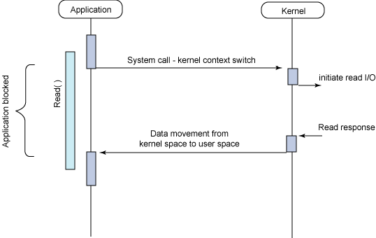

/**
* Create Date:2016年02月28日 星期日 09时22分36秒
* 
* Author:Norman
* 
* Description: 
*/

####阻塞与非阻塞(针对进程在访问数据时,根据IO操作就绪状态来采取不同方式):
    阻塞:读取或写入函数将一直等待
    非阻塞:读取或写入函数会立即返回一个状态值

####同步与异步(应用程序针对内核交互而言):
    同步:指用户进程触发IO操作并等待或轮询去查看IO操作是否就绪
    异步:指用户进程触发IO操作以后便开始做自己的事情.当IO操作已经完成就会得到IO完成通知。

####I/O模型:
####
    1.同步阻塞:
        用户进程在发起一个IO操作以后,必须等待IO操作的完成,只有当真正完成IO操作以后,用户进程才能运行

####
    2.同步非阻塞:
        用户进程发起一个IO操作以后可返回做其它事,但用户进程需要时不时询问IO操作是否就绪,要求用户进程不停去询问,引入不必要CPU资源浪费

####
    3.异步阻塞(select与poll):
        应用发起一个IO操作以后,不等待内核IO操作完成,等内核完成IO操作以后会通知应用程序.
        阻塞是使用select系统调用来完成(select阻塞的)
        使用select好处它可以同时监听多个文件句柄

####
    4.异步非阻塞:
        用户进程只需发起一个IO操作然后立即返回,等IO操作真正完成以后,应用程序会得到IO操作完成的通知.此时用户进程只需要对数据进行处理就好了,不需要进行实际的IO读写操作,因为真正的IO读取或写入操作已经由内核完成了.

####Proactor模式:

####Reactor模式与Proactor模式区别:
    Reactor模式用于同步I/O:
        读取操作:
            1.应用程序注册读就绪事件和相关联事件处理器
            2.事件分离器等待事件的发生
            3.当发生读就绪事件的时候,事件分离器调用第一步注册事件处理器
            4.事件处理器首先执行实际读取操作,然后根据读取到内容进一步处理
        写操作:
            1.应用程序注册写就绪事件和相关联事件处理器
            2.事件分离器等待事件的发生
            3.当发生写就绪事件的时候,事件分离器调用第一步注册事件处理器
            4.事件处理器首先执行实际写操作,然后根据写数据进一步处理

    Proactor模式用于异步I/O操作:
        读取操作:
            1.应用程序初始化一个异步读取操作,然后注册相应事件处理器(事件处理器不关注读取就绪事件,而是关注读取完成事件)
            2.事件分离器等待读取操作完成事件
            3.在事件分离器等待读取操作完成的时候,(操作系统调用内核线程完成读取操作---异步IO都是操作系统负责将数据读写到应用传递进来的缓冲区供应程序操作,操作系统扮演了重要角色),将读取的内容放入用户传递过来的缓冲区中
            4.事件分离器捕获到读取完成事件后,激活应用程序注册的事件处理器,事件处理器直接从缓存区读取数据,而不需要进行实际的读取操作

