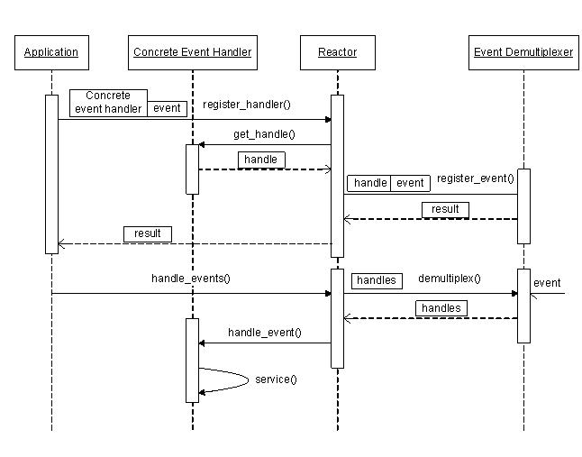

/**
* Create Date:2016年02月24日 星期三 09时27分14秒
* 
* Author:Norman
* 
* Description: 
*/

####Reactor事件处理机制:
    Reactor ----反应堆(事件驱动机制)
    与普通函数调用区别:
        Reactor逆置事件处理流程,应用程序提供相应接品并注册到Reactor上
        事件发生,Reactor主动调用应用程序注册接口(回调函数)

####Reactor框架:
    必备组件:
        1.事件源:
            Linux是文件描述符
            Windows是Socket或Handle
        2.Reactor框架:(libevent event_base结构体)
            Reactor事件管理接口,内部使用event demultiplexer注册 注销事件,并运行事件循环,当有事件进入就绪状态,调用注册事件的回调函数处理事件
        3.多路复用机制:(libevent select poll epoll等)
            1.将关心事件源及事件注册到event demultiplexer上
            2.事件触发,event demultiplexer发出通知
            3.程序收到通知后对事件进行处理
        4.事件处理程序:(libevent event结构体)
            提供一组接口,每个接口对应一种类型事件,供Reactor相应事件发生时调用,执行相应事件处理

####

####[Python Twisted框架](./Twisted/)
