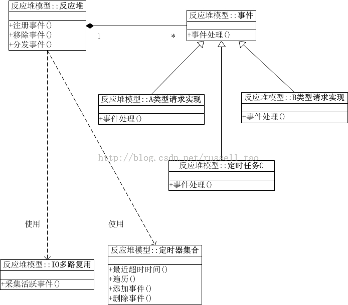
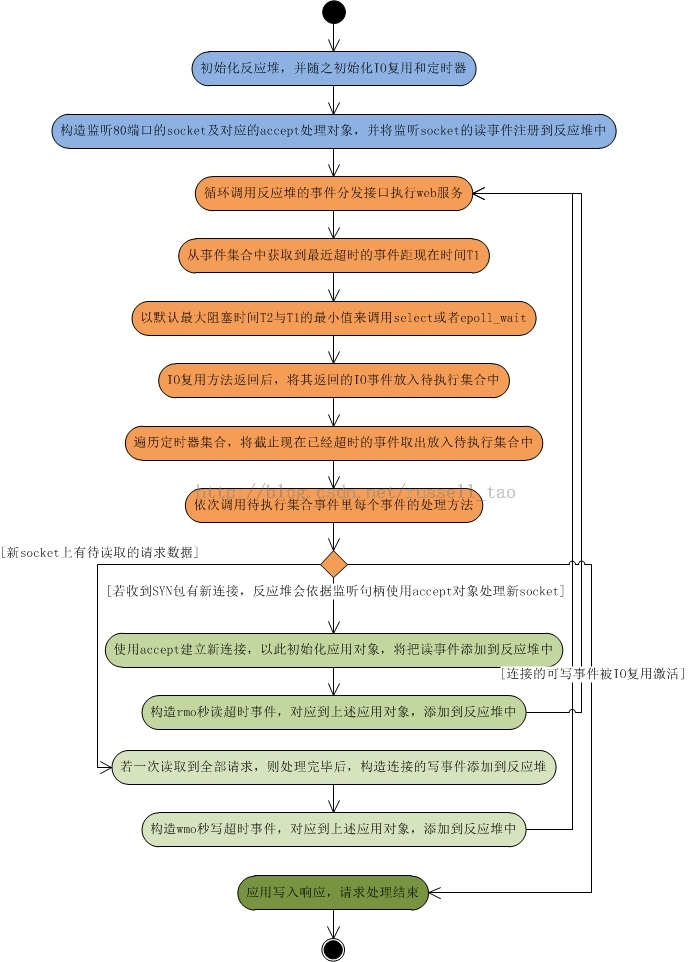

/**
* Create Date:2016年02月24日 星期三 12时48分10秒
* 
* Author:Norman
* 
* Description: 
*/

####反应堆:
    反应堆包含:IO复用与定时器触发功能(必备)

####传统IO复用与反应堆区别:
    1.传统IO复用:随着请求类型增加,请求状态增加,请求命令增加.主程序复杂快速膨胀,导致维护越来越困难
    2.反应堆:将事件驱动框架分离出具体业务,将不同类型请求之间用OO思想分离
            1.不仅使用IO复用处理网络事件驱动
            2.还实现定时器来处理时间事件的驱动(请求超时或定时任务处理)

####:
    1.处理应用时基本OO思想,不同类型请求处理间是分离的
    2.应用处理请求逻辑,与事件分发框架分离
    3.反应堆上提供注册,移除事件方法,供应用代码使用,而分发事件方法,通常是循环调用而已
    4.IO多路复用也是一个抽象,可以是具体的select 或epoll 
    5.定时器也是由反应堆对象使用,必须至少提供4个方法(添加 删除定时器事件)

####
