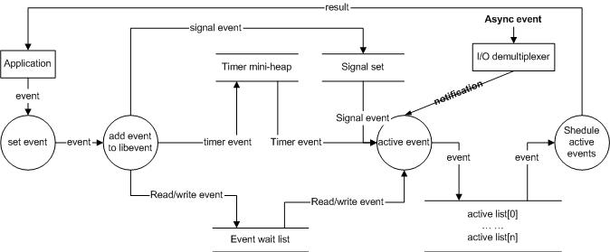

/**
* Create Date:2016年02月28日 星期日 13时02分08秒
* 
* Author:Norman
* 
* Description: 
*/

####libevent基本步骤:
    1.初始化libevent库,并保存返回的指针
    struct event_base * base = event_init();
    2.初始化事件event 设置回调函数,和关注事件
    evtimer_set(&ev,timer_cb,NULL);

    3.设置event从属的event_base
    event_base_set(base,&ev);

    4.添加事件
    event_add(&ev,timeout);

    5.进入无限循环,等待就绪事件并执行事件处理
    event_base_dispatch(base);

####事件处理流程:
####
    1.应用程序准备并初始化event 设置好事件类型与回调函数

    2.向libevent添加事件event:
        定时事件:libevent 使用小根堆管理 key为超时时间
        对于signal和I/O事件:libevent将其放入等待链表中(双向链表)

    3.调用event_base_dispatch()进入无限循环,等待事件.
    select()函数为例:
        每次循环前libevent检查定时事件最小超时时间。
        根据tv设置select()最大等待时间,以便于后面及时处理超时事件
        当select()返回后,首先检查超时事件,然后检查I/O事件
        libevent将所有就绪事件,放入到激活链表中
        然后对激活链表中的事件,调用事件的回调函数执行事件处理;
