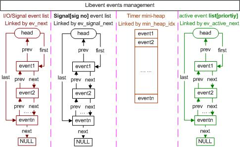

/**
* Create Date:2016年02月28日 星期日 13时43分24秒
* 
* Author:Norman
* 
* Description: 
*/

####libevent核心(基于libevent2.0.22):
    event结构:
        Libevent基于事件驱动
        event是Reactor框架中事件处理程序组件;它提供了函数接口 供Reactor在事件发生时调用。以执行相应事件处理

####
    event管理:
        1:当有事件event转变为就绪状态时,libevent将它移入active event list[priority]中
        2:libevent根据自己调度策略选择就绪事件,调用cb_callback()函数执行事件处理
        3:根据就绪的句柄和事件类型填充cb_callback函数的参数

####事件设置的接口函数:
    1.要向libevent添加一个事件,首先设置event对象
    2.通过调用libevent提供函数
        event_set(struct event* ev,int fd,short events)
        1.设置事件ev绑定文件描述符或者信号,对于定时事件,设为-1即可
        2.设置事件类型:EV_READ|EV_PERSIST,EV_WRITE,EV_SIGNAL等
        3.设置事件回调函数以及参数arg
        4.初始化其它字段,如:event_base 和优先级
        
        event_base_set(struct event_base *base,struct event *ev)
        设置event ev将要注册到的event_base;
        libevent的全局event_base指针 current_base 默认情况下事件ev将被注册到current_base上
        使用该函数可以指定不同的event_base 
        如果一个进程中存在多个libevent实例,必须调用庐函数为event设置不同的event_base

        event_priority_set(struct event* ev,int pri)
        设置event ev优先级。
        注意:
            ev正处于就绪状态时,不能设置 返回-1

    
