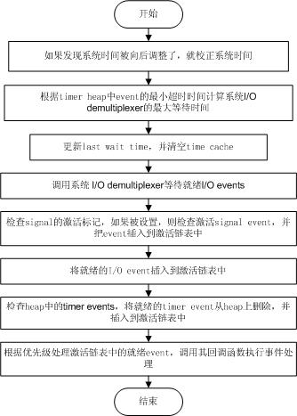

/**
* Create Date:2016年02月28日 星期日 18时54分43秒
* 
* Author:Norman
* 
* Description: 
*/

####事件主循环:
    libevent事件处理中心部分----事件主循环:
        根据系统提供的事件多路分发机制执行事件循环,对已注册的就绪事件,调用注册事件回调函数来处理事件

    libevent将I/O事件 定时器和信号事件处理很好结合到一起.

####事件处理主循环:
    libevent 主循环主要通过event_base_loop()函数完成.

####
    event_base_loop()函数:

####I/O和Timer事件的统一:
    1.Signal事件统一到系统的I/O多路复用中不像Timer事件那么自然
    2.Signal事件出现对于进程来说完全是随机的,进程不能只是测试一个变量来判断是否发生了一信号
    3.如果当Signal发生时,并不立即调用event的callback函数处理信号,而是设法通知系统I/O机制,让其返回.然后再统一和I/O事件以及Timer一起处理。

