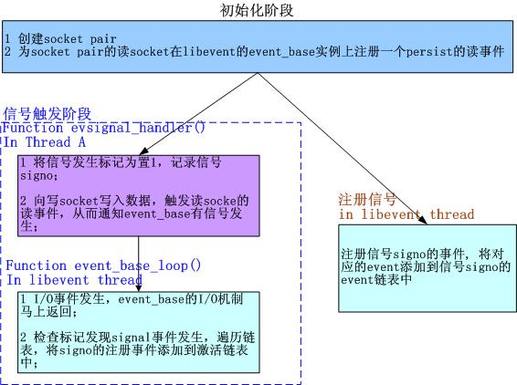

/**
* Create Date:2016年02月28日 星期日 20时05分19秒
* 
* Author:Norman
* 
* Description: 
*/

####集成Signal到事件主循环框架:
    1.使用socket pair ---消息机制
        Socket pair是一个socket对,包含两个socket 一个读socket 一个写socket
    2.libevent 提供evutil_socketpair()创建一个socket pair
####

####

####集成到事件主循环----通知event_base:
    1.Socket pair创建
    2.为socket pair的读socket在libevent的event_base实例上注册一个persist读事件
    3.当向写socket写入数据时,读socket就会得到通知,触发读事件,而event_base得到相应通知

####

