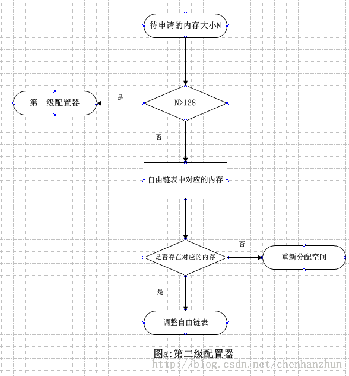

/**
* Create Date:2016年02月29日 星期一 19时39分43秒
* 
* Author:Norman
* 
* Description: 
*/

####空间配置:
    STL中空间配置是最底层的东西,为容器提供服务

####C++管理内存:
    new和delete进行操作:
    new 操作
        1.调用::operator new 配置内存
        2.调用对象的构造函数,构造对象并初始化
    delete操作
        1.调用对象的析构函数析构对象
        2.调用::operator delete释放内存

####STL中的空间配置:
    1.内存配置操作由空间配置器stl::alloc 负责
    2.内存申请由alloc::allocate()负责
    3.内存释放由alloc::deallocate()负责
    4.对象构造操作由::construct()负责
    5.对象析构操作由::destroy()负责

    STL异常处理:
        1.内置轻量级内存池的实现(用于处理小块内存的分配,应对内存醉片问题)
        2.多线程中的内存分配处理(针对内存池的互斥访问)

####第一级配置器:
    __malloc_alloc_template 
    1.对malloc realloc free函数简单封装,并考虚到分配失败后的异常处理
    2.异常处理:由于内存不足,处理异常时
        2.1:用户自己设计异常处理例程,若用户没有定义,仅仅是打印错误信息并强制退出
    
####第二级配置器:
    __default_alloc_template 考虑内容:
        1.内存碎片问题
            对于内存大于128bytes移交给第一级配置器处理
            对于内存小于128bytes申请,利用内存池来管理,直接从内存池分配即可,
            并维护自由链表,自由链表是来分配同样小内存和回收小内存
            小额区块内存需求量上调为8的倍数,自动向上取整8的倍数
        2.内置一个轻量级内存池
        3.多线程环境下内存池互斥访问的机制

####
    分配空间:
        1.若用户申请内存大于,则调用第一级配置分配空间
        2.若小于128bytes检查对应自由链表free_list 如果自由链表有可用区块,则直接使用,若不存在,则调用填充函数 refill为自由链表重新填充空间

    释放空间:
        1.判断区块大小,大于128bytes直接调用第一级配置器
        2.小于128bytes则找出相应自由链表free_list将其回收

    重新填充:
        1.自由链表无可用区块时被调用
        2.默认自由链表申请20个节点,
    
    内存池管理机制:
        1.内存池剩余空间满足20个区块的需求量,直接获取对应大小的空间
        2.内存池剩余空间不能满足20个区块需求量,但足够供应一个及以上区块,则获取满足条件区块个数的空间
        3.内存池剩余空间不能满足一个区块大小时:
            1.判断内存池中是否有残余零头内存空间,有则回收,将其编入free_list
            2.向heap申请空间，补充内存池
                堆中有足够空间,空间分配成功
                堆中没有空间,malloc失败
            3.查找free_list中是否有未用区块,调整进行释放,编入内存池,然后递归调用chunk_alloc函数从内存池取空间供free_list备用
            4.搜索free_list释放空间也未能解决,调用第一级配置器利用out-of-memory机制尝试解决内存不足问题.判断用户申请内存大于128bytes 则调用第一级配置分配空间
