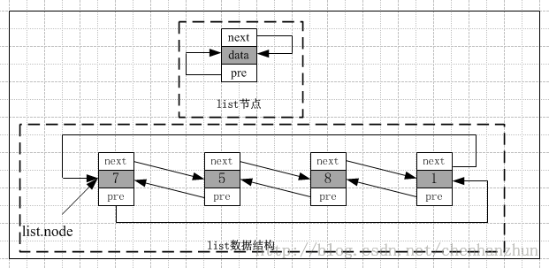

/**
* Create Date:2016年03月03日 星期四 08时33分22秒
* 
* Author:Norman
* 
* Description: 
*/

####有序容器List:
    list容器是一个循环双向链表(内存空间效率比vector容器高)<stl_list.h>

####vector容器与list容器区别:
    1.list容器内存空间不一定是连续存储,内存之间采用迭代器或节点指针进行连接，并且在插入或删除数据节点时,就配置或释放一个数据节点,并不会分配额外内存空间.
    2.vector容器内存空间是连续存储的,且在分配内存空间时,会分配额外可用空间

    3.list容器在进行插入操作或拼接操作时,迭代器并不会失效,且不能以普通指针作为迭代器。(因为普通指针的+或-操作只能指向连续空间的后移地址或前移个地址,不能保证指向list的下一个节点.)
    4.迭代器必须是双向迭代器---因为list具备前移和后移的能力

####list节点和list数据结构:
####
    1.list容器中list本身和list节点是分开设计的:
        list节点结构:是存储数据和指向相邻节点的指针

