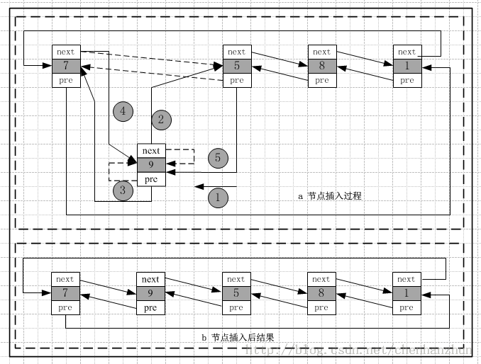
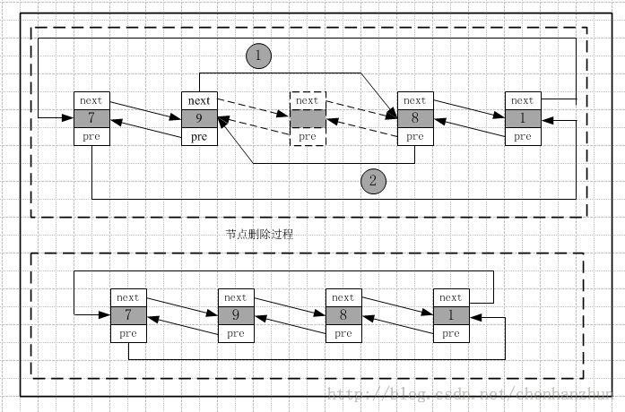
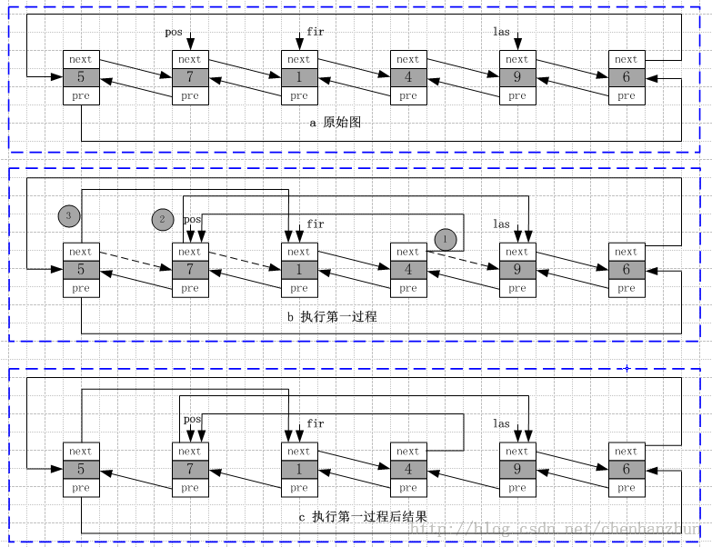
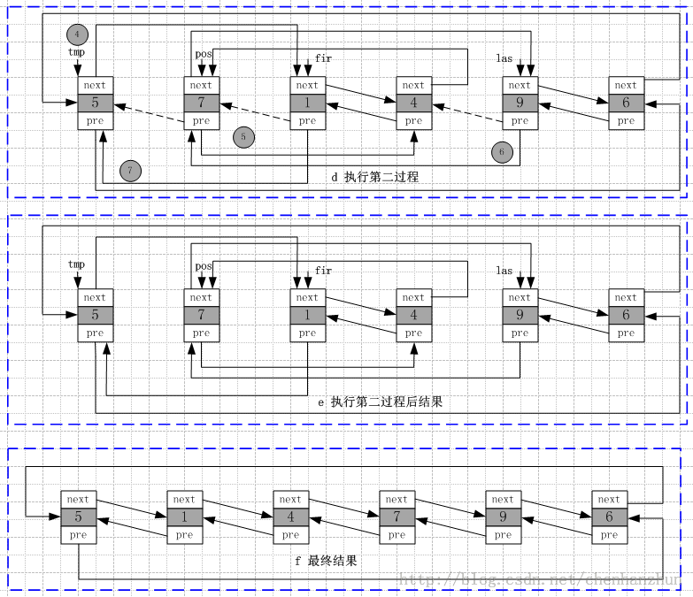

/**
* Create Date:2016年03月03日 星期四 08时49分58秒
* 
* Author:Norman
* 
* Description: 
*/

####list迭代器:
    1.list容器内存空间存储不一定是连续的.则不能用普通指针做迭代器
    2.list容器的迭代器是双向迭代器(list容器排序成员函数sort不能使用STL算法中的排序算函数)
    3.STL中排序算法接受迭代器是随机访问迭代器
    4.list容器在进行插入和拼接操作时迭代器不会失效

####list insert函数分析:
####
    插入函数:在指定位置插入初始值为value节点
    1.首先初始化节点9 并为其分配节点空间
    2.调整节点5指针方向,使其与节点9连接
    3.调整节点5的前驱结点7指针的方向,使其与节点9连接

####list erase函数分析:
####
    擦除步骤:
        1.调整待删除节点直接前驱指针,使其指向待删除节点的直接后继节点
        2.调整待删除节点直接后继指针方向,使其指向待删除节点的直接前驱节点
        3.释放待删除节点对象,回收待删除节点内存空间。

####list splice函数分析
####
####
    拼接函数核心:迁移函数transfer()和splice()函数分析
    执行步骤:
        1.Remove[first,last] from its old position
        2.splice[first,last] into its new position

####[list sort排序算法分析](./list_sort.md)

####list容器操作符重载:

