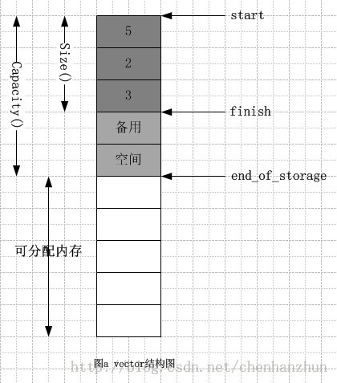

/**
* Create Date:2016年03月02日 星期三 21时05分41秒
* 
* Author:Norman
* 
* Description: 
*/

####序列容器Vector
    容器可分为:
        序列容器
        关联容器
    
    vector类似于C++内置数组类型array 
    vector与array区别:
        1.内置数组array是静态空间,分配内存空间后不能改变
        2.vector容器可以根据用户数据变化而不断调整内存空间大小

####Vector容器详解:
    Vector容器空间分为:
        已使用空间:vector容器大小
        可用空间:vector容器可容纳最大数据空间capacity

    特点:
    1.vector是一段连续性空间(vector迭代器等价于原生态的指针)
    2.vector依赖于内存置和内存初始化,以及迭代器
    3.vector内存空间发生配置时,可能会发生数据移动,回收旧内存空间(不断操作会降低效率)
    4.vector分配内存时,会预留一些备用(用户可用空间)<stl_vector.h>

    vector容器数据结构:
        1.vector容器采用线性连续空间
        2.vector两个迭代器管理内存空间
            _Tp* _M_start;           //目前使用空间的头
            _Tp* _M_finish;          //目前使用空间的尾
            _Tp* _M_end_of_storage;  //可用空间的尾

####

####[vector迭代器](./vector_iterator.md)
