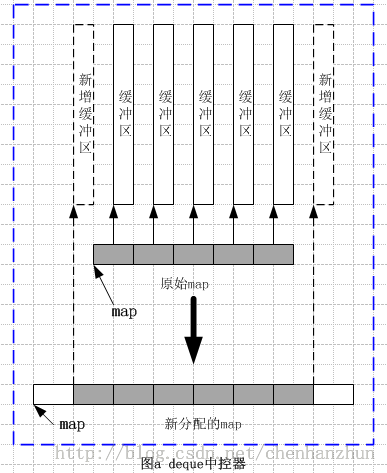

/**
* Create Date:2016年03月03日 星期四 21时14分51秒
* 
* Author:Norman
* 
* Description: 
*/

####deque:
    源码<stl_deque.h>
    双向开口分段连续线性空间,可以在头尾端进行元素的插入和删除

####deque与vector区别:
    1.deque允许于常数时间内对头端进行插入或删除元素
    2.deque是分段连续线性空间.随时可以增加一段新的空间.
    3.deque不像vector那样,vector当内存不够时,需重新分配/复制数据/释放原始空间
    4.deque迭代器设置比vector复杂.不能使用普通指针(尽量使用vector)
    5.deque元素排序,为提高效率:
        1.把deque数据复制到vector
        2.利用vector排序算法,排序后再复制回deque

####deque容器:
    deque分段连续线性空间,对外接口类似于连续空间。
    使用map管理分段空间deque容器
    map连续空间,每个元素指向缓冲区的指针,缓冲区是deque存储数据主体

####

####[deque迭代器](./deque_iterator.md)
