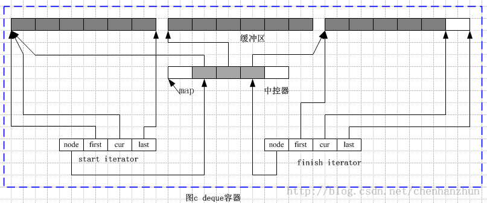

/**
* Create Date:2016年03月03日 星期四 21时50分28秒
* 
* Author:Norman
* 
* Description: 
*/

####deque迭代器:
    deque是分段连续的线性空间.普通指针不能作为deque迭代器
    迭代器必须能够进行operator++或operator--操作
    为了能够用户随机访问容器,必须对操作符进行重载

    deque迭代器功能:
        1.必须知道缓冲区位置
        2.能够判断是否处于其所在缓冲区的边界
        3.能够知道其所在缓冲区当前所指位置的元素

####deque中控器,缓冲区和迭代器之间相互关系
####

####deque容器的数据结构:
    deque容器具有维护map和迭代器的功能, 
    deque定义的两个迭代器分别是start和finish 分别指向第一个缓冲区的第一个元素和最后一个缓冲区的最后一个元素的下一个位置

####deque容器的结构:
####
