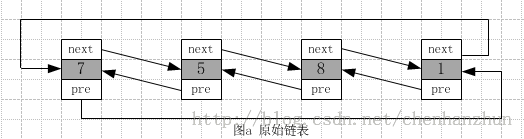
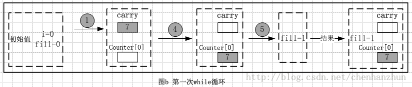
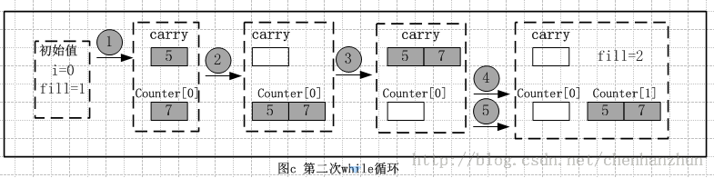
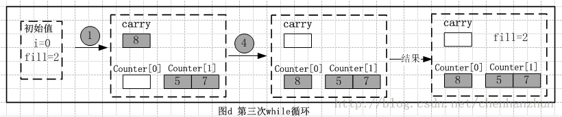
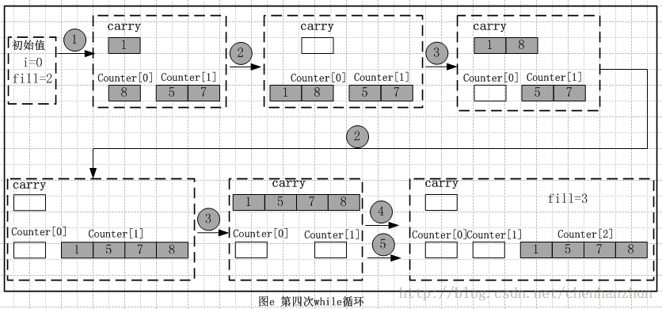
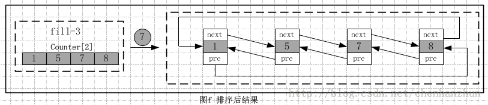

/**
* Create Date:2016年03月03日 星期四 12时31分53秒
* 
* Author:Norman
* 
* Description: 
*/

####list sort算法分析:
    STL本身排序算法sort接受输入迭代器是随机访问迭代器,但是双向list链表容器的访问方式是双向迭代器(因此不能使用STL本身排序算法sort必须自定义自己访问排序算法)

####排序算法实现过程:
    1.定义搬运作用的链表carry
    2.具有中转站作用的链表counter

    1.对counter[i]里面存储数据的规则进行分析,
    2.carry负责取出原始链表的头一个数据节点和交换数据中转站作用

####实现步骤:
####
    1.定义初始值fill = 0 原始链表有四个节点,原始链表非空

####
    第一次while循环:
        1.搬运链表carry取出当前链表第一个数据节点7 初始值i=0 嵌套while条件不成立,跳过while循环
        2.交换carry和counter[i](i=0)的内容,此是i=fill 更新值++fill 即fill=1

####
    第二次while循环:
        1.搬运链表carry取出当前链表第一个数据节点5 初始值i=0 while循环条件成立
        2.将carry链表的内容有序的合并到counter[i](i=0)链表中
        3.交换carry和counter[0]内容且i++ 此时carry有两个有序节点5、7 counter[0]为空链表,i的值为i=1 while循环条件不成立
        4.交换carry和counter[1]的内容
        5.更新fill的值++fill 第二次while循环结束。

####
    第三次循环:
        1.搬运链表carry取出当前链表第一个数据节点8 初始值i=0 while循环条件不成立 跳过while循环
        2.交换carry和counter[i](i=0)内容 此时i不等于fill 则不更新fill值 即fill=2

####
    第四次循环:
        1.搬运链表carry取出当前链表的第一个数据节点1 初始值i=0 while条件成立
        2.carry链表内容有序合并到counter[i](i=0)链表中
        3.交换carry和counter[0]内容且i++ while条件成立
        4.carry内容有序合并到counter[1]链表中
        5.交换carry和counter[1]内容且++i while不成立

    最后由于当前链表为空.跳出while 执行for语句
####
