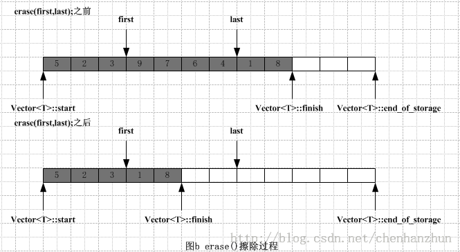
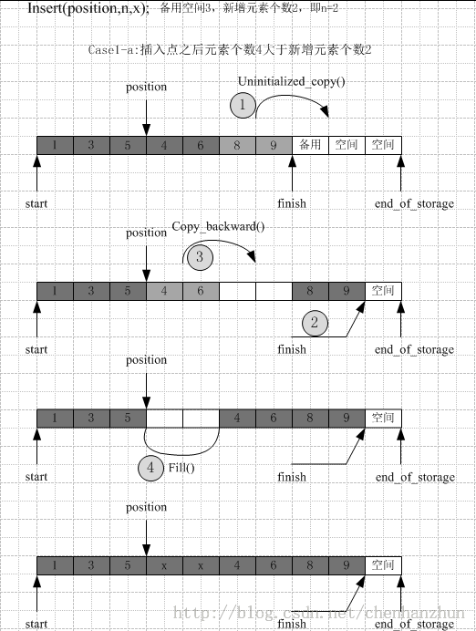
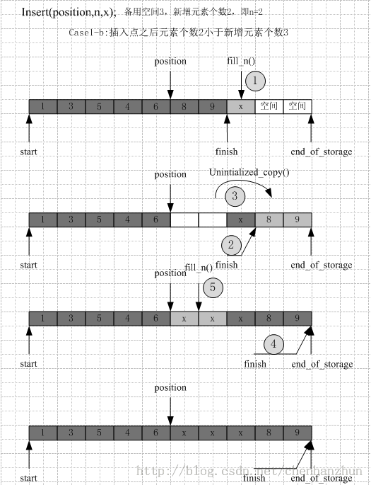
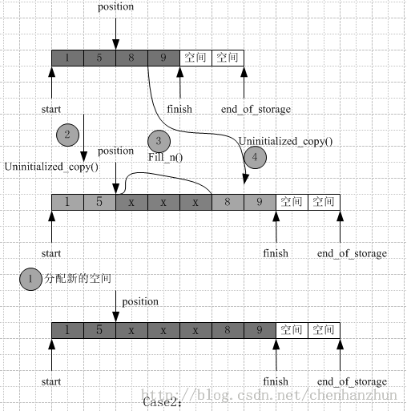

/**
* Create Date:2016年03月02日 星期三 21时18分38秒
* 
* Author:Norman
* 
* Description: 
*/

####vector迭代器:
    vector容器维护空间是线性连续的.所以普通指针也可以作为迭代器。
    如:operator*, operator-> , operator++ , operator-- ,operator+,operator-,operator+=等 
    vector容器支持随机访问。

####vector构造函数和析构函数:

####vector erase方法原理图:
    erase函数:
        迭代器start和end_of_storage并没有改变,只是调整迭代器finish 并析构待擦除元素对象
###

####vector insert方法原理图:
    在指定位置position上连续插入n个初始值为x的元素,根据插入元素个数和可用空间大小的比较,分别进行不同的初始化.
####
    插入点之后现有元素个数大于新插入元素个数:
        1.把[finish-n,finish]之间数据复制[finish,finish+n]
        2.把[position,old_finish-n]之间数据复制[old_finish-n,old_finish]
        3.在指定位置(插入点)填充初始值

####
    插入点之后的现在元素个数不大于新插入元素个数:
        1.先在可用空间填入n-elems_after个初始值x
        2.调整迭代器finish
        3.把[position,old_finish]之间数据复制到[old_finish,finish]
        4.填充[position,old_finish]之间初始值x

####
    备用空间小于新插入元素个数:
        1.把原始数据复制到新空间,调整迭代器
        2.新空间为旧空间的两倍,或旧空间+新增长元素个数
        3.配置新空间
        4.把插入点之前原始数据复制到新空间
        5.将新加入数据添加在[new_finish,new_finish+n]
        6.将插入点之后的原始数据复制到新空间
        7.释放原来空间的对象和内存
        8.调整迭代器所指位置
