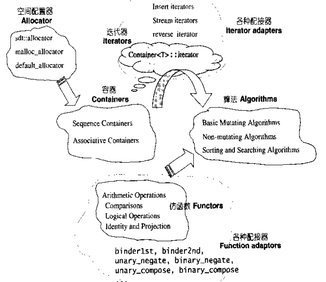

/*########################################################
####File Name: README.md
####Created Time:2015年11月21日 星期六 21时13分02秒
####Author: Norman 
####Description: STL 源码剖析
##########################################################*/
####STL 六大组件
####[1.容器(Containers)](./Containers)
    各种数据结构:(用来存放数据)
        vector
        list
        deque
        set
        map
    实现角度:
        STL容器是一种class template

####[2.算法(Algorithms)](./Algorithms)
    常用算法:
        sort
        search
        copy
        erase
    实现角度:
        STL算法是一种function template

####[3.迭代器(Iterators)](./Iterator)
    容器与算法之间胶合剂是所谓"泛型指针"
    实现角度:
        迭代器是一种将operator* operator-> operator++ operator--等指针相关操作予以重载的class template
        所有STL容器都有自己专属的迭代器
        原生指针也是一种迭代器

####[4.仿函数(Functors)](./Functors)
    行为类似函数,可作为算法的某种策略(policy)
    仿函数是一种重载了operator()的class或class template一般函数指针可视为狭义的仿函数

####[5.配接器(Adapters)](./Adapters)
    一种用来修饰器(containers)或仿函数(functors)或迭代器(Iterators)接口的东西

####[6.配置器(Allocators)](./Allocators)
    负责空间配置与管理(实现动态空间配置,空间管理,空间释放的class template)

####[7.Traits萃取技术](./Traits/)
####[8.函数对象](./funObject)

