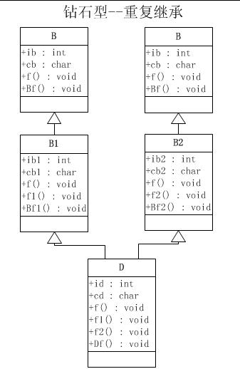

/**
* Create Date:2016年03月11日星期五 16:12:04
* 
* Author:Norman
* 
* Description: 
*/

####重复继承:
    某个基类被间接地重复继承了多次

####
####[源代码](../RepeatedInheritance.cpp)
####
    1.孙子类中包含重复的基类数据成员.叫重复继承
    2.C++引入虚基类的概念解决
