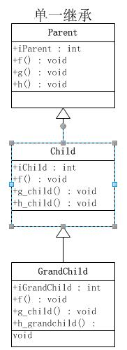
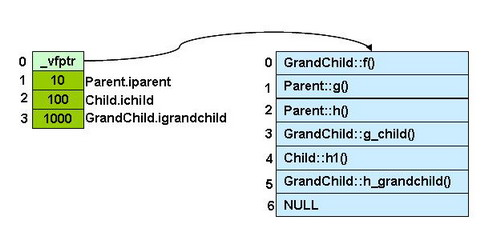

/**
* Create Date:2016年03月11日星期五 10:49:15
* 
* Author:Norman
* 
* Description: 
*/

####单一的一般继承:
####
    1.父类 子类 孙子类都有自己成员变量
    2.子类覆盖了父类的f()方法
    3.孙子类覆盖了子类的g_child()及其超类的f()
####[源码验证](../SingleInherit.cpp)
####
