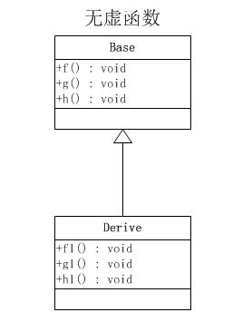
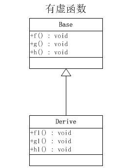
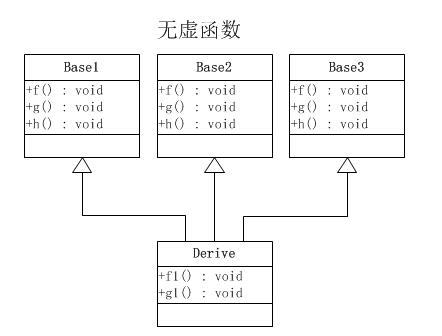
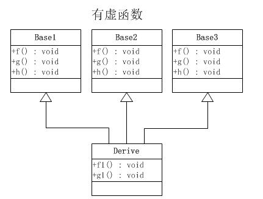

/**
* Create Date:2016年03月11日星期五 08:26:49
* 
* Author:Norman
* 
* Description: 
*/

####有无虚函数对比:
####1.一般继承(无虚函数覆盖)
####
####
    1.虚函数按照顺序放于表中
    2.父类的虚函数在子类的虚函数前面

####2.一般继承(有虚函数覆盖)
####
####
    1.覆盖的f()函数被放到虚表中原来父类虚函数的位置
    2.没有被覆盖的函数依旧

####3.多重继承(无虚函数覆盖)
####
####
    1.每个父类都有自己的虚表
    2.子类的成员函数被放到第一个父类的表中(按声明顺序来判断)
    3.目的是为了解决不同的父类类型的指针指向同一个子类实例,而能够调用到实际的函数

####4.多重继承(有虚函数覆盖)
####
####
    三个父类虚函数表中的f()位置被替换成子类的函数指针,可以任一静态类型的父类来指向子类,并调用子类f()函数
