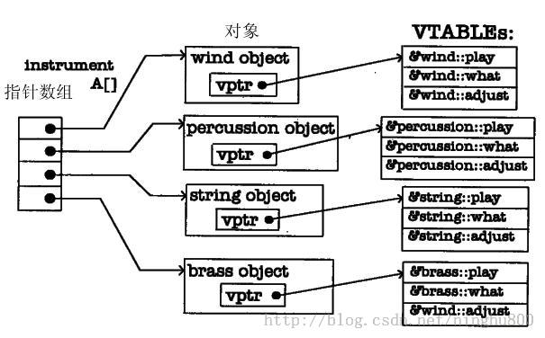
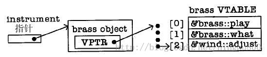

/**
* Create Date:2016年03月 9日星期三 18:02:52
* 
* Author:Norman
* 
* Description: 
*/

####Virtual实现原理:

####
    1.在没有Virtual情况下,以基类指针调用时编译器并不知道比基类更多的东西,通常调用函数的基类版本
    2.当有virtual 声明函数时,每当创建一个包含虚函数的类或者从包含虚函数的类派生的类时,编译器就创建一个Vtable
    3.如果派生类没有对基类的virtual函数进行重新定义,Vtable中填充基类的虚函数的地址
    4.编译器在类中放置一个Vptr Vptr指向相应的Vtable Vptr的初始化在构造函数中完成

####
    1.Vptr常常在对象的开头
    2.所有的Vtable有相同的顺序
        不管何种类型的对象play()是第一个
        what()是第二个
        adjust()是第三个--- 编译器知道adjust在Vptr+2处 而不是以instrument::adjust地址调用这个函数

