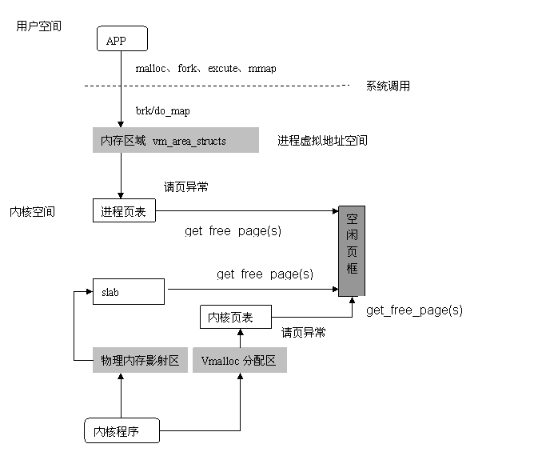

/**
* Create Date:2016年01月23日 星期六 14时54分40秒
* 
* Author:Norman
* 
* Description: 
*/

####进程对内存分配和管理:
    从用户向内核看:
        逻辑地址(逻辑地址段机制转化成线性地址)
        线性地址(线性地址又经过页机制转化为物理地址)
        物理地址

####进程内存空间:
    Linux操作系统采用虚拟内存管理技术.每个进程各自互不干涉的进程地址空间.
    该空间块大小为4G线性虚拟空间
    4G进程地址空间分为:
        用户空间(0~3G):
            1.用户进程通常只能访问用户空间虚拟地址,不能访问内核空间虚拟地址
            2.用户空间进程切换,用户空间就会跟着变化
            3.每个进程用户空间独立,互不干扰的
        内核空间(3G~4G):
            1.用户进程进行系统调用时可以访问内核空间
            2.内核空间凡内核负责映射,不会随进程改变,固定的,内核空间地址有自己对应页表,用户进程各有不同页表
    
####进程内存管理:
    进程内存管理的对象是进程线性地址空间上的内存镜像!
    内存镜像:
        就是进程使用的虚拟内存区域
    进程虚拟空间:
        1.是32或64位独立连续区间地址空间.
        2.虚拟空间被划分为许多大小可变(4096倍数)内存区域,这些区域在进程线性地址中有序排列
        3.划分原则:将访问属性一致的地址空间存放在一起。(可读,可写,可执行)

    Linux内核中对应进程内存区域数据结构是:vm_area_struct
    内核将每个内存区域作为一个单独的内存对象管理,相应操作也一致,采用面向对象方法使VMA结构体可以代表多种类型内存区域

    1.vm_area_struct描述进程地址空间基本管理单元.
    2.vm_area_struct结构以链表形式链接关联不同内存区域
    3.为方便查找,内核又以红黑树形式组织内存区域,以便降低搜索耗时,并存两种形式,并非冗余
        链表用于需要遍历全部节点时用。
        红黑树形组织内存区域,降低内存区域上各种不同操作都能获得高性能

    进程地址空间对应描述结构是"内存描述符结构"它表示进程全部地址空间
    包含了进程地址空间有关全部信息,当然包含进程的内存区域

####进程内存分配与回收:
    1.内存申请获得不是实际内存,而是虚拟内存(最终会归结到do_mmap()函数上) brk调用被单独以系统调用实现
    2.内核使用do_mmap()函数创建一个新的线性地址区间.
    3.释放一个内存区域使用do_ummap() 销毁对应内存区域

####虚拟地址转为物理地址:
    1.申请内存仅是对一个新的线性地址区间使用权.
    2.物理内存只有当进程去访问新获取的虚拟地址时,才会由"请求页机制"产生缺页异常,从而进入分配实际页面的例程
    3.请求页机制---会告诉内核真正为进程分配物理页,并建立对应页表,这虚拟地址才映射到物理内存上。

####系统物理内存管理:
    应用程序操作对象是映射到物理内存之上虚拟内存,但处理器直接操作的是物理内存
    应用程序---->虚拟地址---->物理地址---->CPU解析地址访问请求(转换查询页表)

    地址转换:将虚拟地址分段,使每段虚地址作为一个索引指向页表,页表项则指向下一级页表或指向最终的物理页面.

    每个进程都有自己的页表,进程描述符pgd域指向就是进程页全局目录

####物理内存管理(页管理):
    Linux内核管理物理内存通过分页机制实现:
        1.将整个内存划分成无数个4K大小的页(分配回收基本单位)
        2.实际使用内存分配连续内存块,页表不需要更改
        3.采用"伙伴"关系来管理空闲页面(最小单位只能是2的幂倍页面大小)
        4.内核中分配空闲页基本函数:get_free_page/get_free_pages 分配单页或分配指定页面
            4.1:get_free_page在内核中分配内存(不同于malloc利用堆动态分配,实际调用brk()系统调用)
            4.2:brk()系统调用作用是扩大或缩小进程堆空间
            4.3:现有内存区域不够容纳堆空间，以页大小倍数为单位扩张或收缩对应的内存区域
            4.4:brk值并非以页面大小为倍数修改,而是按实际请求修改
            4.5:malloc可以以字节为单位分配,但在内核以页为单位为配的
        5.物理页由页结构struct page描述,系统所有页都存储在数组mem_map[]中 通过该数据找到系统中每一页
        6.空闲页由伙伴关系组织的空闲页链表(free_area[MAX_ORDER])来索引

####内核内存使用:
    内核物理内存最小分配单位---页
    内核使用内存小于一页内存(存放文件描述符,进程描述符 虚拟内存区域描述符等)
    
    Slab分配器:(核心思想---存储池)
        1.Linux使用Slab分配器把内存片段看作对象,使用完后,缓存到存储池留下次使用(避免频繁创建销毁)
        2.主要目的:减少对伙伴算法调用次数,利用硬件缓存提高访问速度
        3.Slab没有脱离伙伴关系独立存在内存分配方式，建立在页基础上(将页面撕成众多小内存块以供分配)
        4.slab中对象分配和销毁使用kmem_cache_alloc与kmem_cache_free

    Kmalloc:
        1.Slab不仅只用来存放内核专用结构体,还用来处理内核对小块内存请求
        2.内核中小于一页小内存请求才通过slab分配器提供接口Kmalloc来完成(32到131072字节)
        3.内核看来kmalloc看成get_free_page(s)补充

####内核非连续内存分配(Vmalloc):
    1.伙伴算法，slab技术都是防止"分片"
    2.分片:
        2.1:外部分片:
            系统虽有足够内存,但却是分散碎片,无法満足大块"连续内存"的需求
        2.2:内部分片:
            満足小段内存区需要,不得不分配一大区域连续内存给它,从而造成空间浪费

