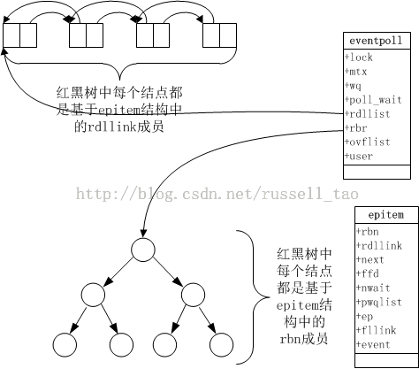

/**
* Create Date:2016年02月27日 星期六 10时25分29秒
* 
* Author:Norman
* 
* Description: 
*/

####IO复用与并发:
    并发:服务器每一毫秒处理数百个不同TCP连接,并还有数十万未处理不活跃连接,同时处理并行发生事件的连接
    高并发:同时处理万计,十万计连接,服务器并发编程追求处理并发连接数目无限大,同时维持着高效CPU

####并发编程实现模型:
    1.与线程捆绑(执行效率太低,由操作系统调度分配---线程频繁睡眠,唤醒)
    2.高并发编程方法(两个阶段分开处理):
        1.等待消息代码段(线程主动查询,IO多路复用----select与epoll)
        2.处理消息代码段

####epoll与select原理区别:
    epoll与select高并发核心:一个线程处理所有连接的"等待消息准备好"
    
    epoll实现方法:
        1.epoll_create() 创建epoll描述符
        2.epoll_ctrl(添加或删除所有待监控的连接)
        3.epoll_wait(返回活跃连接)

    epoll_wait 在内核态维护一个数据结构(红黑树)保存着所有待监控的连接.
    结点的增加 减少通过epoll_ctrl来完成
####

####epoll边缘触发和水平触发:
    ET模式:
        精确的返回连接(只有连接从一个状态转到另一个状态时,才会触发epoll_wait返回它)
        
    LT模式:
        每次满足期待状态的连接,都得在epoll_wait中返回,

