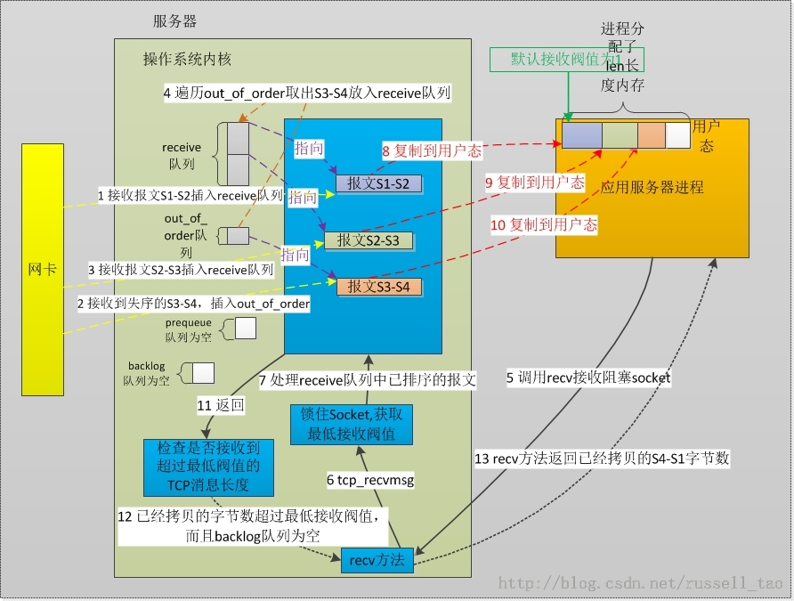
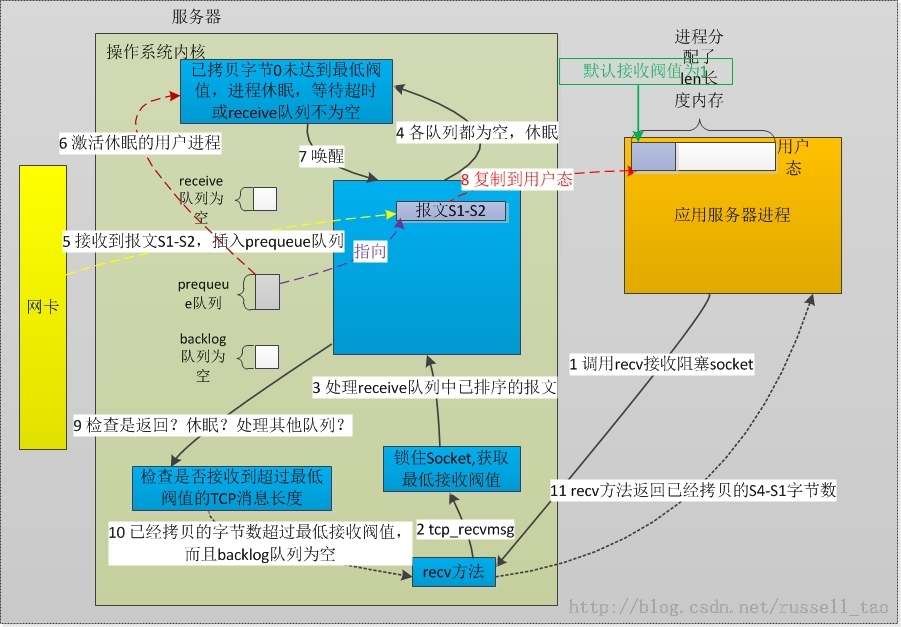
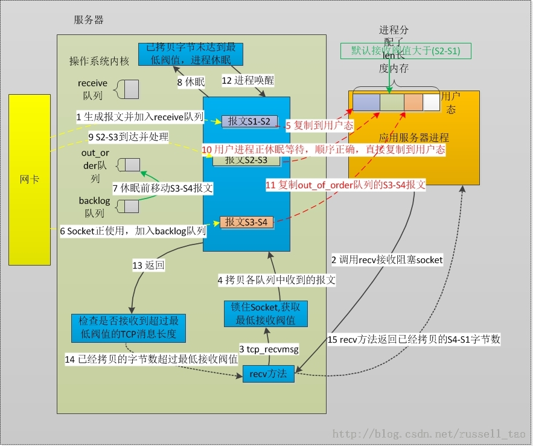

/**
* Create Date:2016年02月24日 星期三 20时30分48秒
* 
* Author:Norman
* 
* Description: 
*/

####场景1:
    接收TCP消息分为:
        1.PC网卡接收到网线上传来报文,通过软中断内核拿到并且解析其为TCP报文,然后TCP模块决定如何处理这个TCP报文
        2.用户进程调用read recv方法获取TCP消息,将内核已经从网卡上收到的消息流拷贝到用户进程里内存中

####

####内核处理接收消息:
    1.receive队列容器
    2.out_of_order队列容器
    3.prequeue队列容器
    4.backlog队列容器

####内核接收消息步骤:
    网卡部分:
    1.网卡接收到消息判断为TCP协议后,调用tcp_v4_rcv方法(查看下一个报文)将报文直接插入到receive队列中
    (将收到S1 TCP报文,去TCP头部,排好序放入,用户进程可以直接按序读取队列)
    2.收到S3-S4报文(判断并不是S2)进入out_of_order队列。乱序报文暂时放在这
    3.收到S2-S3报文,直接进入receive队列 (此时out_of_order不为空)
    4.在插入receive时会检查out_of_order队列。插入S2-S3后将S3-S4从out_of_order队列插入到receive队列中(tcp_ofo_queue方法完成)
    5.用户进程读取socket 进程申请内存然后调用read或recv方法
    6.接收消息使用内核态tcp_recvmsg方法接收

####tcp_recvmsg方法剖析:
    用户进程部分:
    1.锁住socket 互斥锁
    2.将数据拷贝到用户态内存
    3.将receive队列拷贝完后检查backlog队列.backlog队列是进程正在拷贝数据时,网卡收到报文会进这个队列
    4.若backlog没有数据,释放锁,返回用户态
    5.用户进程recv方法返回从内核拷贝字节

####场景2:用户进程调用recv方法,没有接收到连接。socket阻塞状态,进入睡眠状态
####

####接收步骤:
    1.用户进程分配内存,将其传入recv函数
    2.调用tcp_recvmsg方法来处理
    3.锁住socket
    4.阻塞等待消息
    5.消息到tcp_v4_rcv调用tcp_prequeue方法把消息插入prequeue队列中
    6.插入prequeue队列后,此时调用wake_up_interruptlble方法唤醒socket上睡眠进程
    7.进程唤醒,重新调用lock_sock接管sock
    8.进程醒来,检查receive队列,再检查prequeue队列。prequeue队列中有消息把内容复制到用户内存中,再释放内核中消息
    9.检查backlog有没数据,有直接拷贝给用户。没有释放socket锁
    9.返回拷贝字节数

####场景3:读到一部分,此时乱序消息进入队列
####
