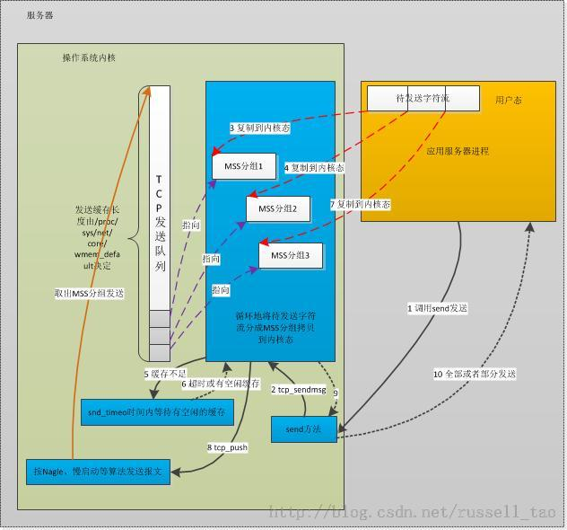

/**
* Create Date:2016年02月24日 星期三 17时43分44秒
* 
* Author:Norman
* 
* Description: 
*/

####tcp消息分析:
    经过三次握手TCP建立连接后,调用send或write方法发送数据内核处理流程:
        概念:
        1.MTU:最大传输单元MTU
            1.1:发送层:内核IP网络层试图发送报文时,若一个长度大于MTU限制,就会被分成若干个小于MTU的报文,每个报文都会有独立的IP头部
            1.2:接收层:根据收到的多个IP包头,将IP包重组为一个消息

        2.MSS:(最大报文段长度)
            2.1:定义一个TCP连接上,一个主机期望对端主机发送单个报文最大长度
            2.2:TCP三次握手连接时,连接双互相互告知自己期望接收到的MSS大小
            2.3:MSS值不可靠,原因经过中间路由主机可能小于期望的MSS大小,会导致中间出现IP分片(避免方法:IP头部DF标志位,告诉IP报文经过路由不要对这个报文分片.若IP报文必须分片则直接返回ICMP错误)

        3.tcp_write_queue发送队列
        4.阻塞和非阻塞套接字
        5.拥塞窗口
        6.滑动窗口
        7.Nagle算法:
            sk_stream_wait_memory 若内核缓存不足按超时时间指示等待
                  |
                  V
            tcp_sendmsg 拷贝用户态数据到内核态发送数据缓存中
                  |
                  V
            tcp_push 
                  |
                  V
            tcp_cwnd_test  检查飞行中的的报文个数是否超过拥塞窗口  
                  |
                  V
            tcp_snd_wnd_test 检查待发的序号是否超出了发送窗口
                  |
                  V
            tcp_nagle_test 根据nagle算法检查是否该发送
                  |
                  V
            tcp_window_allows 检查待发送的报文长度是否超出拥塞容器和发送窗口最小值
                  |
                  V
            tcp_transmit_skb 调用IP层方法发送报文

####

####Send发送数据步骤:
    1.App 应用程序调用send发送较大的数据
    2.内核通过tcp_sendmsg方法
    3.Send方法不是同步,send方法返回成功,也不一定IP报文都发送成功:
        3.1:将数据按MSS划分多个报文段
        3.2:复制到内核中sk_buff结构来存放.同时把这些分片组成队列
        3.3:把分片放到TCP对应的tcp_write_queue发送队列中
    4.TCP连接内核缓存由(/proc/sys/net/core/wmem_default定义)
        4.1:当没有多余内核态缓存来复制用户态待发送数据时,调用sk_stream_wait_memory来等待滑动窗口移动,释放一些缓存出来
    5.收到ACK后就不需要缓存原来已经发出报文,释放掉缓存
    6.将剩余用户态数据组成MSS报文拷贝到内核态sk_buff中
    7.调用tcp_push方法,调用IP层方法发送tcp_write_queue队列中报文 
    8.发送方法返回

