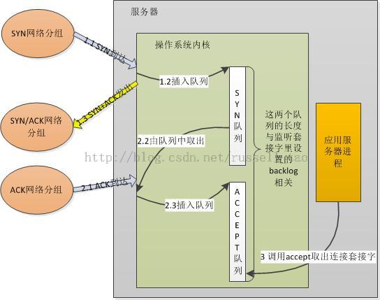

/**
* Create Date:2016年02月24日 星期三 17时27分59秒
* 
* Author:Norman
* 
* Description: 
*/

####高性能服务器开发:
    三次握手原理:
    1.服务器绑定 监听某个端口后,内核创建SYN队列和ACCEPT队列
    2.客户端使用connect向服务器发起TCP连接
    3.SYN包到达服务器后,内核将信息放到SYN队列中,同时回一个SYN+ACK包给客户端
    4.客户端再次发来SYN包的ACK 内核会把连接从SYN队列中取出,再把连接放到ACCEPT队列中。
    5.调用accept时,其实就是直接从ACCEPT队列中取出已经建立成功的连接套接字

####

####accept阻塞和非阻塞模式:
    1.阻塞模式:accept判断ACCEPT队列是否为空，为空阻塞(默认阻塞) 若单独线程调用accept建议设为阻塞模式
    2.非阻塞模式:ACCEPT队列为空立即返回EAGAIN错误,若read write等业务与accept用一个线程建议将accept设为非阻塞模式
