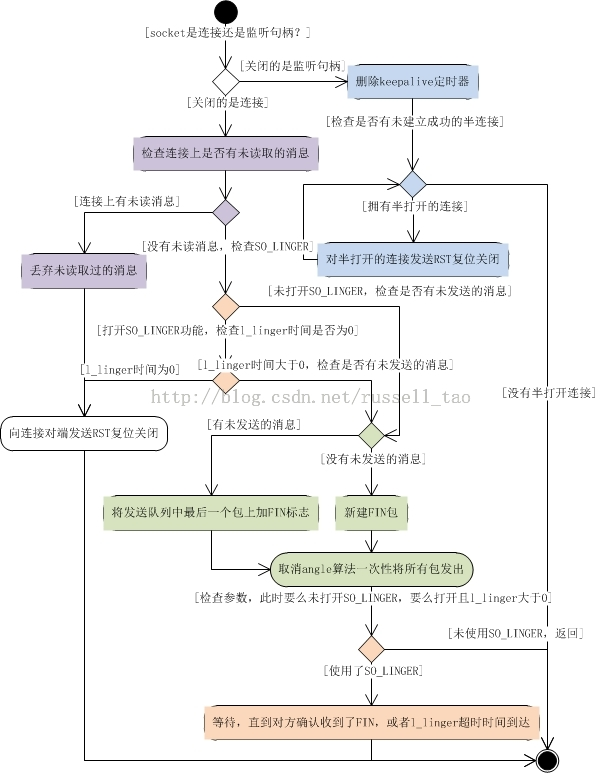
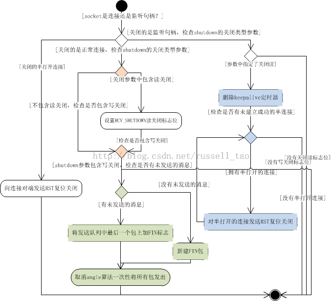

/**
* Create Date:2016年02月25日 星期四 08时28分29秒
* 
* Author:Norman
* 
* Description: 
*/

####进程与线程区别:
    线程:是轻量级进程
    进程:创建进程只能是一个进程创建另一个进程 子进程复制父进程资源

####线程创建与进程创建相同处与不同点:
    相同点:
        1.创建进程由clone系统调用实现。
        2.创建线程也是由clone系统调用实现,
        3.调用copy_file来拷贝文件描述符
    不同点:
        1.创建线程传入flag参数中包含CLONE_FILES标志位
        2.创建进程没有此标志位,把进程打开文件描述符引用计数加1

####多线程与多进关闭系统调用区别:
    close ---> sys_close  --->filp_close --->fput --->__fput--->sock_close --->sock_release --->inet_release --->tcp_close

    shutdown --->sys_shutdown --->inet_shutdown ---> tcp_shutdown

####
    1.关闭监听句柄:
        1.1:清理三次握手成后在服务器上有许多半连接:
            1.1.1:close 移除keepalive定时器(常用于防止僵死,异常退出的客户端占用服务器连接资源)
            1.1.2:keepalive定时器移除后,ESTABLISH状态的TCP在tcp_keepalive_time时间内没有通讯,服务器就会主动关闭连接
            1.1.3:关闭每一个半连接.(发送RST复位标志去关闭请求)
    
    2.关闭普通ESTABLISH状态连接(未设置so_linger):
        2.1:检查是否有收到没处理的消息,会向客户端发送一个RST非正常复位关闭连接
        2.2:没有未处理消息,进入发送FIN来关闭连接阶段.
            1.如果有待发送消息,尽力保证消息发送出去,在最后一个报文中加入FIN标志位
            2.关闭用于减少网络中小报文的angle算法,向连接对端发送消息
            3.如果没有待发送消息,构造一个报文,仅含有FIN标志位,发送出去关闭连接

    3.使用了so_linger连接:
        1.so_linger用来保证对方收到close时发出消息(需要对方发送ACK到服务器)
        2.so_linger需要超时时间(避免对方总不响应,close一直阻塞)

####
    1.shutdown 可带一个参数(只关闭读,只关闭写,同时关闭读写)
        关闭读:不再接收新的连接(半连接使用RST关闭与close一样)
        关闭写:(针对监听句柄,不做任何事)
    2.shutdown是半打开连接,发出RST来关闭连接
    3.shutdown是正常连接,把服务器接收到的消息丢掉.服务器上调用read读不到任何数据
    4.关闭写时发出FIN包,告诉客户端不会再发消息了

