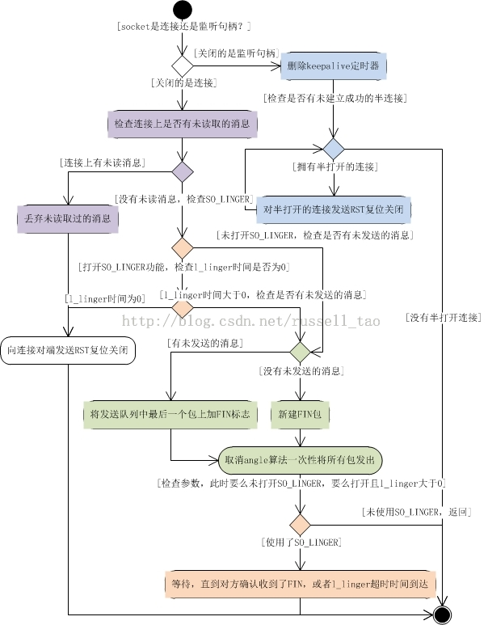
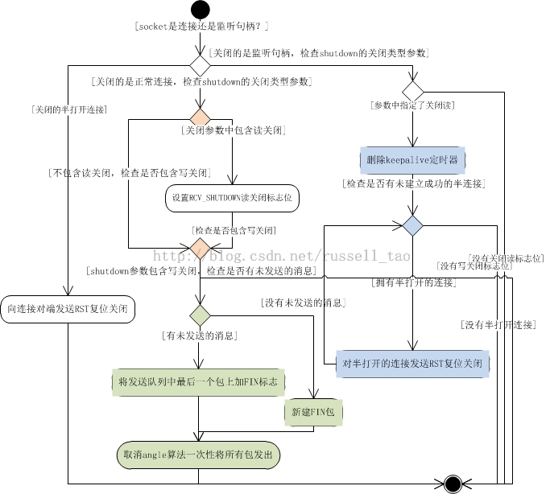

/**
* Create Date:2016年02月25日 星期四 08时28分29秒
* 
* Author:Norman
* 
* Description: 
*/

####进程与线程区别:
    线程:是轻量级进程
    进程:创建进程只能是一个进程创建另一个进程 子进程复制父进程资源

####线程创建与进程创建相同处与不同点:
    相同点:
        1.创建进程由clone系统调用实现。
        2.创建线程也是由clone系统调用实现,
        3.调用copy_file来拷贝文件描述符
    不同点:
        1.创建线程传入flag参数中包含CLONE_FILES标志位
        2.创建进程没有此标志位,把进程打开文件描述符引用计数加1

####多线程与多进关闭系统调用区别:
    close ---> sys_close  --->filp_close --->fput --->__fput--->sock_close --->sock_release --->inet_release --->tcp_close

    shutdown --->sys_shutdown --->inet_shutdown ---> tcp_shutdown

####

####

