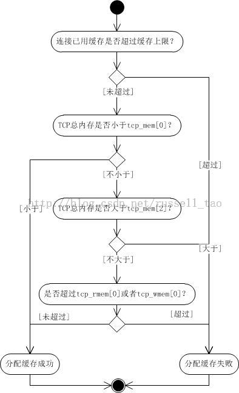

/**
* Create Date:2016年02月27日 星期六 20时58分27秒
* 
* Author:Norman
* 
* Description: 
*/

####TCP 连接的内存设置方法:
    1.socket编程提供SO_SNDBUF SO_RCVBUF接口来设置连接读写缓存
    2.linux系统提供net.ipv4.tcp_rmem等来设置整体服务器TCP内存的使用

####Linux下系统配置项说明:
    net.ipv4.tcp_rmem = 8192 87380 16777216  
    net.ipv4.tcp_wmem = 8192 65536 16777216  
    net.ipv4.tcp_mem = 8388608 12582912 16777216  
    net.core.rmem_default = 262144  
    net.core.wmem_default = 262144  
    net.core.rmem_max = 16777216  
    net.core.wmem_max = 16777216 

    tcp_rmem[2] 与rm_max跟接收缓存最大值有关
    tcp_wmem[1] 与wmem_default 表示发送缓存默认值

####linux为了TCP连接上传输数据怎样管理读写缓存:
    1.缓存上限:
        setsockopt方法实现SO_SNDBUF SO_RCVBUF(只对设置过的连接有影响)
        SO_SNDBUF:连接上内核写缓存上限(内核会翻一倍再作为写缓存)
        受制于系统net.core.wmem_max限制:
            大于时被wmem_max替代
            小于时内核最小值为2K字节
        
        SO_RCVBUF:读缓存上限
        内核实际也是2倍大小作为读缓存的使用上限
        内核2.6.18下限256字节

####SO_SNDBUF SO_RCVBUF与内存关系:
    1.实际使用未达到上限,SO_SNDBUF SO_RCVBUF不起作用
    2.收到客户端TCP报文,读缓存增加,进程调用read recv函数读缓存就减少
    3.服务器进程调用send write函数发送TCP流时,写缓存增大,客户端收到并发起ACK写缓存就会减少

####缓存上限作用:
    读缓存达到上限:丢弃新收到报文,防止TCP连接消耗太多服务器资源
    写缓存达到上限:使send这样的函数方法失败,内核不为其分配内存

####缓存大小与TCP滑动窗口关系:
    读缓存作用:
        1.将无序,落在接收滑动窗口内的TCP报文缓存起来(缓存无序报文)
        2.当有序的时,程序会把读缓存中报文读取(缓存待延时读取的有序报文)
    受制于同一个上限值,服务器进程读取过慢时,缓存受套接字缓存,使接收滑动窗口缩小。通知对端降低发送速度,避免无谓网络传输.
    net.ipv4.tcp_adv_win_scale = 2 
    拿出1/(2^tcp_adv_win_scale)缓存出来做应用缓存(拿出1/4内存做应用读缓存)

    net.ipv4.tcp_moderate_rcvbuf = 1 
    打开TCP内存自动调整功能

####
    1.系统TCP总体内存超了tcp_mem[2]新内存分配都会失败
    2.tcp_rmem[0]或者tcp_wmem[0]优先级也高,只要条件1不超限,那么只要连接内存小于这两个值,就保证新内存分配一定成功
    3.只要总体内存不超过tcp_mem[0],那么新内存在不超过连接缓存的上限时也能保证分配成功
    4.tcp_mem[1]与tcp_mem[0]构成了开启关闭压力模式的开关,在压力模式下,连接缓存上限可以减少,非压力模式下,连接缓存上限可能会增加。最多增加到tcp_rmem[2]或tcp_wmem[2]

