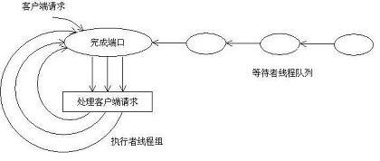

/**
* Create Date:2016年02月28日 星期日 10时48分20秒
* 
* Author:Norman
* 
* Description: 
*/

####
    主要参与者:
        1.完成端口:(是一个先进先出队列,操作系统的IO子系统在IO操作完成后,会把相应 IO包放入该队列)
        2.等待者线程队列:通过调用GetQueuedCompletionStatus API 在完成端口等待取下一个IO packet
        3.执行者线程组:已经从完成端口上获得IO packet 在占用CPU进行处理
        4.IO Handle与完成端口相关联:(任何期望使用IOCP方式来处理IO请求的,必须将相应的IO Handle与该完成端口相关联)
        5.线程与完成端口相关联:任何调用GetQueuedCompletionStatus API线程,都将与该完成端口相关联。

####IOCP主要关注问题:
    基于IOCP实现服务吞吐量:
        基于IOCP开发是异步IO
    IOCP模式下线程切换:
        通过引入IOCP 大减少thread切换带来的额外开销
    基于IOCP实现消息乱序问题:
        在使用TCP时,TCP协议本身保证了消息传递的次序,大大降低了上层应用复杂性
